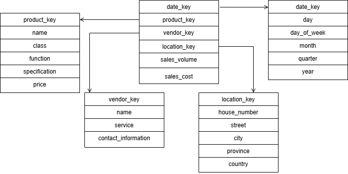
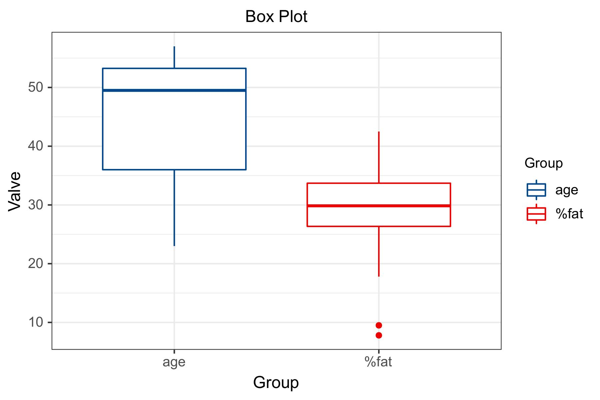
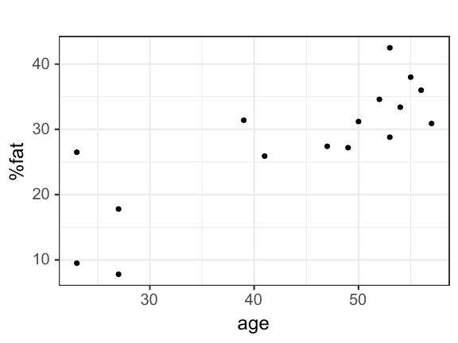

# 第一次作业

**姓名：王泽黎
学号：2022K8009929011**

## 1

a) 该数据仓库的星形模式图如下:

b) 操作如下:
    1. Roll up on time from day to year
    2. Roll up on product from name to all
    3. Roll up on location house_number name to all
    4. Slice on vendor name = "A"
然后就能得到每年 vendor A 的 sales_volume

## 2

1. 数据仓库整体采用多层架构:
$Data Sources → Operation Data Store → Data Warehouse(DWD → DWB → DWS) → applicationData Service$

2. 详细分层设计如下:
   1. ODS层: 存储从业务系统提取的原始数据，如:
      1. 用户原始数据
      2. 内容原始数据
      3. 互动行为日志
      4. 广告投放记录
      5. 系统日志等
   2. DWD层: 存储经过清洗、转换和整合后的数据，主要包括:
      1. 用户维度表
      2. 内容维度表
      3. 互动行为事实表
      4. 时间维度表
      5. 地理位置维度表
      6. 商业交易维度表等
   3. DWB层: 存储经过聚合和汇总的数据，主要包括:
      1. 用户行为数据
      2. 内容推荐数据
      3. 广告投放效果数据等
   4. DWS层: 存储经过建模和分析的数据，主要包括:
       1. 用户画像数据
       2. 内容推荐模型数据
       3. 广告投放效果模型数据等
   5. 应用层: 作为前端，提供数据产品和数据分析使用的数据，面向用户

3. 应用场景:
   1. 内容推荐分析：基于用户兴趣与内容特征的分析
   2. 用户行为分析：活跃度、留存率、转化率等指标的分析
   3. 商业价值分析：广告投放效果、用户付费行为等指标的分析

综上，通过这种设计实现用户从多个维度进行查询和挖掘的需求

## 3

a) 运算结果如下

|DataType|   Mean   |Median|Standard Deviation|
|--------|----------|------|------------------|
|  age   |  44.125  | 49.5 |   12.05132254    |
| %fat   | 28.05625 | 29.85|    9.1506809     |

b) boxplots for age and %fat:

c) 

d) Normalize the two variables based on Z-score normalization:

|age|%fat|
|---|----|
|-1.752919643|-2.027854561|
|-1.752919643|-0.170069311|
|-1.421005864|-2.213633086|
|-1.421005864|-1.120818233|
|-0.425264529|0.365409966|
|-0.259307639|-0.235638203|
|0.238563028|-0.071715975|
|3.065943786|1.972456399|
|0.487498362|0.343553669|
|0.653455251|0.715110719|
|0.736433696|1.578434453|
|0.736433696|0.081278105|
|0.819412141|0.583972937|
|0.902390585|1.086667769|
|0.98536903|0.868104799|
|1.068347475|0.310769224|

e) $r = \frac{\text{Cov}(X, Y)}{\sigma_X \sigma_Y} = \frac{95.1725}{12.05132254*9.1506809} ≈ 0.863025$

这两个变量呈正相关

## 4

a) Partition into equal-depth bins:

- bin1: 23, 23, 27, 27
- bin2: 39, 41, 47, 49
- bin3: 50, 52, 53, 53
- bin4: 54, 55, 56, 57

Smoothing by bin median:

- bin1: 25, 25, 25, 25
- bin2: 44, 44, 44, 44
- bin3: 52.5, 52.5, 52.5, 52.5
- bin4: 55.5, 55.5, 55.5, 55.5

b) Partition into equal-depth bins:

- bin1: 23, 23, 27, 27
- bin2: 39, 41, 47, 49
- bin3: 50, 52, 53, 53
- bin4: 54, 55, 56, 57

Smoothing by bin boundaries:

- bin1: 23, 23, 27, 27
- bin2: 39, 39, 49, 49
- bin3: 50, 53, 53, 53
- bin4: 54, 54, 57, 57

c) Partition into equal-width bins:

数据范围：57 - 23 = 34 箱子宽度：34 ÷ 4 = 8.5

- bin1: 23, 23, 27, 27
- bin2: 39
- bin3: 41, 47
- bin4: 49, 50, 52, 53, 53, 54, 55, 56, 57

Smoothing by bin means:

- bin1: 25, 25, 25, 25
- bin2: 39
- bin3: 44, 44
- bin4: 53.22, 53.22, 53.22, 53.22, 53.22, 53.22, 53.22, 53.22, 53.22
