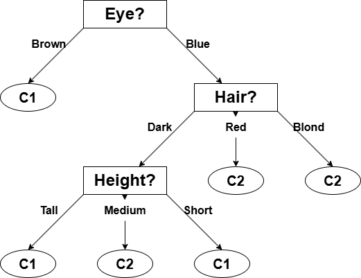
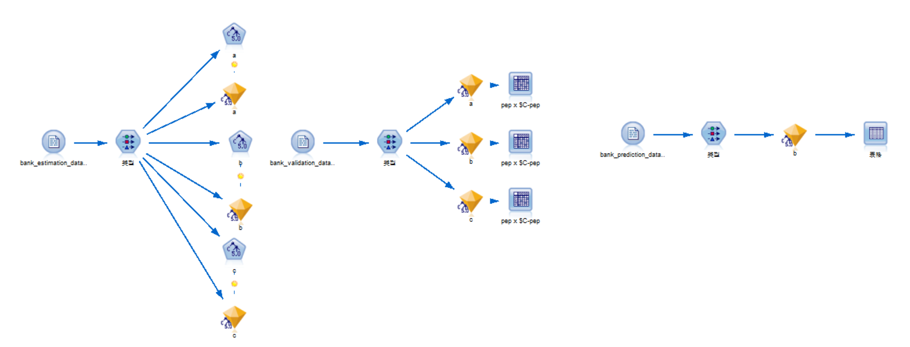
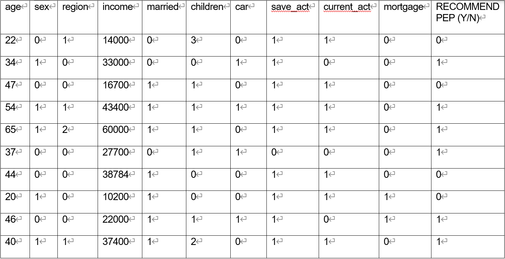

# 第二次作业

**姓名：王泽黎
学号：2022K8009929011**

## 1

1) $I(5,4) ≈ 0.991$
$E(Height) ≈0.846$
$E(Hair) ≈ 0.805$
$E(Eye) ≈ 0.612$
$Gain(Height) = I(5,4) - E(Height) = 0.145$
$Gain(Hair) = I(5,4) - E(Hair) = 0.186$
$Gain(Eye) = I(5,4) - E(Eye) = 0.379$

2) Decision tree constructed with Information Gain:

## 2

- 输入层设计:
  - 身高 (Height):
    - 高 (Tall): [1, 0, 0]
    - 中 (Medium): [0, 1, 0]
    - 矮 (Short): [0, 0, 1]
  - 头发 (Hair):
    - 金色 (Blond): [1, 0, 0]
    - 黑色 (Dark): [0, 1, 0]
    - 红色 (Red): [0, 0, 1]
  - 眼睛 (Eye):
    - 棕色 (Brown): [1, 0]
    - 蓝色 (Blue): [0, 1]
  - 共有 8 个输入节点
    - $I_1, I_2, I_3$ 表示身高
    - $I_4, I_5, I_6$ 表示头发
    - $I_7, I_8$ 表示眼睛
- 输出层设计:
  - 班级 (Class):
    - 班级 1: [1, 0]
    - 班级 2: [0, 1]
  - 共有 2 个输出节点
    - $O_1$ 表示班级 1
    - $O_2$ 表示班级 2
- 隐藏层设计:
  - 根据经验公式法，设计隐含层节点数为 4 个，分别是 $H_1, H_2, H_3, H_4$
- 激活函数均选用 Sigmoid 函数

- 初始参数设置:
  - 初始权重:
    - 输入层到隐含层的权重矩阵 $W_1$:
      - $W_1 = \begin{bmatrix}
        w^1_{11} & w^1_{21} & w^1_{31} & w^1_{41} & w^1_{51} & w^1_{61} & w^1_{71} & w^1_{81} \\
        w^1_{12} & w^1_{22} & w^1_{32} & w^1_{42} & w^1_{52} & w^1_{62} & w^1_{72} & w^1_{82} \\
        w^1_{13} & w^1_{23} & w^1_{33} & w^1_{43} & w^1_{53} & w^1_{63} & w^1_{73} & w^1_{83} \\
        w^1_{14} & w^1_{24} & w^1_{34} & w^1_{44} & w^1_{54} & w^1_{64} & w^1_{74} & w^1_{84} \\
        \end{bmatrix}$
    - 隐含层到输出层的权重矩阵 $W_2$:
      - $W_2 = \begin{bmatrix}
        w^2_{11} & w^2_{21} & w^2_{31} & w^2_{41} \\
        w^2_{12} & w^2_{22} & w^2_{32} & w^2_{42} \\
        \end{bmatrix}$
    - 不妨设 $W_1$ 和 $W_2$ 的初始值均为 0.1(便于计算，实际中可随机初始化)
  - 初始偏置:
    - 输入层到隐含层的偏置 $b_1$:
      - $b_1 = \begin{bmatrix}
        b^1_{1} \\
        b^1_{2} \\
        b^1_{3} \\
        b^1_{4} \\
        \end{bmatrix}$
    - 隐含层到输出层的偏置 $b_2$:
      - $b_2 = \begin{bmatrix}
        b^2_{1} \\
        b^2_{2} \\
        \end{bmatrix}$
    - 不妨设 $b_1$ 和 $b_2$ 的初始值均为 0.1(便于计算，实际中可随机初始化)
  - 初始学习率 $\eta = 0.1$

- 对训练样本(Medium, Blond, Blue, C1):
  - 前向传播:
    - 输入样本编码:
      - $X = \begin{bmatrix}
        0 \\
        1 \\
        0 \\
        1 \\
        0 \\
        0 \\
        0 \\
        1 \\
        \end{bmatrix}$
    - 隐含层输入:
      - $H_{in} = W_1 \cdot X + b_1$
      - $H_{in} = \begin{bmatrix}
        0.4 \\
        0.4 \\
        0.4 \\
        0.4 \\
        \end{bmatrix}$
    - 隐含层输出:
      - $H = sigmod(W_1 \cdot X + b_1)$
      - $H = \begin{bmatrix}
        0.598 \\
        0.598 \\
        0.598 \\
        0.598 \\
        \end{bmatrix}$
    - 输出层输入:
      - $O_{in} = W_2 \cdot H + b_2$
      - $O_{in} = \begin{bmatrix}
        0.339 \\
        0.339 \\
        \end{bmatrix}$
    - 输出层输出:
      - $O = sigmod(W_2 \cdot H + b_2)$
      - $O = \begin{bmatrix}
        0.584 \\
        0.584 \\
        \end{bmatrix}$
  - 反向传播:
    - 目标输出:
      - $T = \begin{bmatrix}
        1 \\
        0 \\
        \end{bmatrix}$
    - 输出层误差:
      - $\delta O = T - O$
      - $\delta O = \begin{bmatrix}
        0.416 \\
        -0.584 \\
        \end{bmatrix}$
    - 隐含层误差:
      - $\delta H = W_2^T \cdot \delta O * H * (1 - H)$
      - $\delta H = \begin{bmatrix}
        -0.004 \\
        -0.004 \\
        -0.004 \\
        -0.004 \\
        \end{bmatrix}$
    - 权重更新:
      - $W_2 = W_2 + \eta * \delta O \cdot H^T$
      - $W_1 = W_1 + \eta * \delta H \cdot X^T$
      - $W_2 = \begin{bmatrix}
        0.1 + 0.1 \cdot 0.416 \cdot 0.598 & 0.1 + 0.1 \cdot -0.584 \cdot 0.598 \\
        0.1 + 0.1 \cdot 0.416 \cdot 0.598 & 0.1 + 0.1 \cdot -0.584 \cdot 0.598 \\
        \end{bmatrix}$
        即为
        $W_2 = \begin{bmatrix}
        0.1249 & 0.0652 \\
        0.1249 & 0.0652 \\
        \end{bmatrix}$
      - $W_1 = \begin{bmatrix}
        0.1 + 0.1 \cdot -0.004 \cdot 0 & 0.1 + 0.1 \cdot -0.004 \cdot 1 & 0.1 + 0.1 \cdot -0.004 \cdot 0 & 0.1 + 0.1 \cdot -0.004 \cdot 1 & 0.1 + 0.1 \cdot -0.004 \cdot 0 & 0.1 + 0.1 \cdot -0.004 \cdot 0 & 0.1 + 0.1 \cdot -0.004 \cdot 0 & 0.1 + 0.1 \cdot -0.004 \cdot 1 \\
        0.1 + 0.1 \cdot -0.004 \cdot 0 & 0.1 + 0.1 \cdot -0.004 \cdot 1 & 0.1 + 0.1 \cdot -0.004 \cdot 0 & 0.1 + 0.1 \cdot -0.004 \cdot 1 & 0.1 + 0.1 \cdot -0.004 \cdot 0 & 0.1 + 0.1 \cdot -0.004 \cdot 0 & 0.1 + 0.1 \cdot -0.004 \cdot 0 & 0.1 + 0.1 \cdot -0.004 \cdot 1 \\
        0.1 + 0.1 \cdot -0.004 \cdot 0 & 0.1 + 0.1 \cdot -0.004 \cdot 1 & 0.1 + 0.1 \cdot -0.004 \cdot 0 & 0.1 + 0.1 \cdot -0.004 \cdot 1 & 0.1 + 0.1 \cdot -0.004 \cdot 0 & 0.1 + 0.1 \cdot -0.004 \cdot 0 & 0.1 + 0.1 \cdot -0.004 \cdot 0 & 0.1 + 0.1 \cdot -0.004 \cdot 1 \\
        0.1 + 0.1 \cdot -0.004 \cdot 0 & 0.1 + 0.1 \cdot -0.004 \cdot 1 & 0.1 + 0.1 \cdot -0.004 \cdot 0 & 0.1 + 0.1 \cdot -0.004 \cdot 1 & 0.1 + 0.1 \cdot -0.004 \cdot 0 & 0.1 + 0.1 \cdot -0.004 \cdot 0 & 0.1 + 0.1 \cdot -0.004 \cdot 0 & 0.1 + 0.1 \cdot -0.004 \cdot 1 \\
        \end{bmatrix}$
        即为
        $W_1 = \begin{bmatrix}
        0.1 & 0.0996 & 0.1 & 0.0996 & 0.1 & 0.1 & 0.1 & 0.0996 \\
        0.1 & 0.0996 & 0.1 & 0.0996 & 0.1 & 0.1 & 0.1 & 0.0996 \\
        0.1 & 0.0996 & 0.1 & 0.0996 & 0.1 & 0.1 & 0.1 & 0.0996 \\
        0.1 & 0.0996 & 0.1 & 0.0996 & 0.1 & 0.1 & 0.1 & 0.0996 \\
        \end{bmatrix}$
    - 偏置更新:
      - $b_2 = b_2 + \eta * \delta O$
      - $b_1 = b_1 + \eta * \delta H$
      - $b_2 = \begin{bmatrix}
        0.1 + 0.1 \cdot 0.416 \\
        0.1 + 0.1 \cdot -0.584 \\
        \end{bmatrix}$
        即为
        $b_2 = \begin{bmatrix}
        0.1416 \\
        0.0416 \\
        \end{bmatrix}$
      - $b_1 = \begin{bmatrix}
        0.1 + 0.1 \cdot -0.004 \\
        0.1 + 0.1 \cdot -0.004 \\
        0.1 + 0.1 \cdot -0.004 \\
        0.1 + 0.1 \cdot -0.004 \\
        \end{bmatrix}$
        即为
        $b_1 = \begin{bmatrix}
        0.0996 \\
        0.0996 \\
        0.0996 \\
        0.0996 \\
        \end{bmatrix}$

## 3

1) P(抽烟) = P(抽烟|研究生) × P(研究生) + P(抽烟|本科生) × P(本科生) P(抽烟) = 0.23 × 0.2 + 0.15 × 0.8 = 0.046 + 0.12 = 0.166
P(研究生|抽烟) = [P(抽烟|研究生) × P(研究生)] / P(抽烟) = 0.23 × 0.2 / 0.166 = 0.046 / 0.166 ≈ 0.276

2) P(本科生) = 0.8, P(研究生) = 0.2, P(本科生) > P(研究生)
故随机选择的学生更可能是本科生

3) 由独立性可得:
P(抽烟且住宿舍|研究生) = 0.23 × 0.3 = 0.069
P(抽烟且住宿舍|本科生) = 0.15 × 0.1 = 0.015
则有:
P(抽烟且住宿舍) = 0.069 × 0.2 + 0.015 × 0.8 = 0.0138 + 0.012 = 0.0258
P(研究生|抽烟且住宿舍) = (0.069 × 0.2) / 0.0258 = 0.0138 / 0.0258 ≈ 0.535
P(本科生|抽烟且住宿舍) = 1 - 0.535 = 0.465
P(研究生|抽烟且住宿舍) > P(本科生|抽烟且住宿舍)
故一个抽烟且住宿舍的学生更可能是研究生

## 上机作业1

1) 建模过程如图:
   
   混淆矩阵见压缩包
2) 根据三个模型的混淆矩阵分析，应选择决策树模型b，理由如下：
   1) 根据准确率判断，b(84.5%) 和 c(84%) 的表现远优于 a(71.5%)
   2) 相比 c，b 的精确率与F1分数更优，说明其误判更少，且其在精确率与召回率的平衡性表现更佳
3) 

## 上机作业2

混淆矩阵见压缩包
